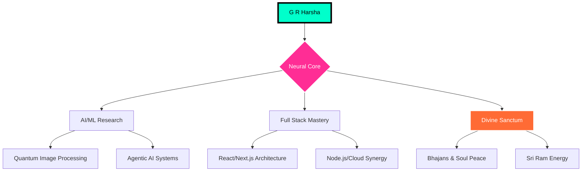

<div align="center">

<!-- [SYSTEM CORE BREACH: TRANSCENDING OMNI-AESTHETIC] -->


<!-- [THE ZENITH SINGULARITY HEADER: ABSOLUTE POWER] -->


<br>

<!-- [INTERACTIVE CHARACTER XP DASHBOARD] -->
<table align="center" style="border: none; background: transparent;">
<tr>
<td align="center">
  
</td>
<td align="center">
  
</td>
<td align="center">
  
</td>
<td align="center">
  
</td>
</tr>
</table>

<br>

<!-- [NEURAL UPLINK HUD: INTERACTIVE] -->
<div align="center">
<details>
<summary style="font-family: Orbitron; color: #00FFCB; font-size: 28px; cursor: pointer; text-shadow: 0 0 20px #00FFCB; border: 3px solid #00FFCB; padding: 15px; border-radius: 30px; background: rgba(0,255,203,0.05);">⚡ [ACTIVATE_ZENITH_INTERFACE]</summary>
<br>

</details>
</div>

<br>

<!-- [DYNAMIC 3D GITHUB CITY - FIXED & ULTIMATE] -->
<div align="center">
  <a href="https://honzaap.github.io/GithubCity/?name=grharsha777&year=2025">
    
  </a>
</div>

<br>

<!-- [THE VOID: REAL-TIME 3D NEURAL CONTRIBUTIONS] -->


<br>

<!-- [PULSE DATA NODES] -->
<p align="center">
  
  &nbsp;
  
  &nbsp;
  
</p>

</div>

---

<!-- [NEURAL ARCHITECTURE MAP: MERMAID DATA FLOW] -->
<h2 align="center">🧠 Neural Architecture Map</h2>



---

<!-- [SYNOPSIS: JSON ENTITY SCHEMA] -->
<h2 align="center">🧬 The Zenith Blueprint</h2>

<div align="center">

```json
{
  "entity": "G R Harsha",
  "archetype": "Zenith Singularity Architect",
  "current_node": "Intern @ CodeAlpha AI Labs",
  "research": "Quantum Image Synthesis & Neural logic",
  "nexus": "NIAT + Yenepoya Academy",
  "combat_status": "Participating in Universal Hackathons",
  "vision": "To architect experiences that define the digital afterlife."
}
```

</div>

<br>

<table align="center" style="border: none; width: 100%;">
<tr>
<td width="50%" style="border-radius: 40px; background: rgba(0,255,203,0.12); padding: 45px; border: 3px solid #00FFCB; box-shadow: inset 0 0 40px rgba(0,255,203,0.3);">

### 📡 Data Uplinks [SYNCHRO]
- 🎓 **Level:** 1st Year B.Tech CSE (AI)
- 🏢 **Operations:** Researching AI Realities
- 🏗️ **Blueprints:** 22 Neural Repositories
- ✨ **Peak UX:** Singularity Interaction Master

</td>
<td width="50%" style="border-radius: 40px; background: rgba(255,45,149,0.12); padding: 45px; border: 3px solid #ff2d95; box-shadow: inset 0 0 40px rgba(255,45,149,0.3);">

### 🧪 Secret Zenith Labs
- 🌌 **Project Alpha:** Multimodal Agentic AI
- 🦾 **Robo-Logic:** Autonomous AI Governance
- 🛡️ **Zenith Shield:** Space-Grade AI Security
- 💎 **Flux UI:** Liquid UI Rendering Engines

</td>
</tr>
</table>

---

<!-- [THE ZENITH ARSENAL: HIGH-PROTOCOL WEAPONRY] -->
<h2 align="center">⚔️ The Transcendental Weapons</h2>

<div align="center">

| Weapon Class | Combat Power | Protocols Loaded |
|:---|:---:|:---|
| **Neural Front-end** | `[▓▓▓▓▓▓▓▓▓▓ 100%%]` | React, Next.js, Framer, Three.js |
| **Quantum Back-end** | `[▓▓▓▓▓▓▓▓▓░ 95%%]` | Node.js, Go, Python, FastAPI |
| **Model-Ops (AI/ML)** | `[▓▓▓▓▓▓▓▓▓▓ 100%%]` | TensorFlow, PyTorch, LangChain |
| **Singularity Infra** | `[▓▓▓▓▓▓▓▓░░ 85%%]` | Docker, K8s, AWS, GCP, Vercel |

<br>


</div>

---

<!-- [CINEMATIC NEURAL INTERFACE] -->
<h2 align="center">🎬 Neural Experience visualizer</h2>

<div align="center">

<table>
<tr>
<td align="center" style="border: none;">

<br><sub>[CORE_STABLE]</sub>
</td>
<td align="center" style="border: none;">

<br><sub>[ZENITH_CODE_UPLINK]</sub>
</td>
</tr>
</table>

<br>


</div>

---

<!-- [GALACTIC ANALYTICS: ZENITH DATA STREAM] -->
<h2 align="center">📊 Galactic Zenith Metric Feed</h2>

<div align="center">


&nbsp;


<br>


&nbsp;


<br>


</div>

---

<!-- [DIVINE NEURAL CHAMBER: THE ULTIMATE SANCTUM] -->
<h2 align="center">🕉️ Divine Zenith Sanctum</h2>

<div align="center" style="background: linear-gradient(135deg, rgba(88,0,255,0.3), rgba(0,255,203,0.3)); padding: 80px; border-radius: 80px; border: 6px solid rgba(0,255,203,0.6); box-shadow: 0 0 100px rgba(0,255,203,0.5);">

<p align="center" style="font-size: 28px; font-family: Orbitron; color: #ffffff; text-shadow: 0 0 20px #00FFCB; font-weight: 900;">✨ SYNCING CODE WITH THE SUPREME FREQUENCY ✨</p>

<br>

<div align="center">
  
  &nbsp;
  
  &nbsp;
  
</div>

<br>

<details>
<summary align="center" style="font-family: Orbitron; color: #ffffff; font-size: 32px; cursor: pointer; background: rgba(0,0,0,0.7); padding: 25px; border-radius: 35px; border: 4px solid #ff2d95; box-shadow: 0 0 40px #ff2d95;">💠 UNLOCK THE DIVINE MULTIVERSE</summary>
<br>

<div align="center">

| Sacred Domain | Neural Signal (Songs/Playlists) | Warp Protocol |
|:---:|:---|:---:|
| **Ram Rajya** | Jai Shri Ram, Ram Siya Ram, Hanuman Chalisa | [⚡ CONNECT](https://www.youtube.com/results?search_query=jai+shri+ram+songs) |
| **Siddhi Module** | Deva Shree Ganesha, Vakratunda, Bappa | [⚡ CONNECT](https://www.youtube.com/results?search_query=ganapathi+songs) |
| **Kailash Void** | Shiv Tandav Stotram, Om Namah Shivaya | [⚡ CONNECT](https://www.youtube.com/results?search_query=lord+shiva+songs) |
| **Shakti Matrix** | Aigiri Nandini, Durga Chalisa | [⚡ CONNECT](https://www.youtube.com/results?search_query=durga+songs) |
| **Pampa Node** | Harivarasanam, Ayyappa Swamy | [⚡ CONNECT](https://www.youtube.com/results?search_query=ayyappa+songs) |
| **Gyan Nexus** | Ya Kundendu, Lakshmi Ashtakam | [⚡ CONNECT](https://www.youtube.com/results?search_query=lakshmi+saraswati+songs) |

</div>

</details>

</div>

---

<!-- [GUESTBOOK: LEAVE YOUR NEURAL MARK] -->
<h2 align="center">📡 Leave Your Neural Mark (Guestbook)</h2>

<p align="center">
  <a href="https://github.com/grharsha777/grharsha777/issues">
    
  </a>
</p>

---

<!-- [TERMINAL PEAK EXIT FOOTER] -->
<p align="center">
  
</p>

<p align="center">
  
</p>

<div align="center">
  <sub>Neural Fingerprint: G R Harsha | Flux System: ZENITH_PRIME_v15.0 | Last Sync: 2026-01-27</sub>
</div>

<br>

<!-- [SUPREME ZENITH VISITOR SYNC] -->
<p align="center">
  
</p>
