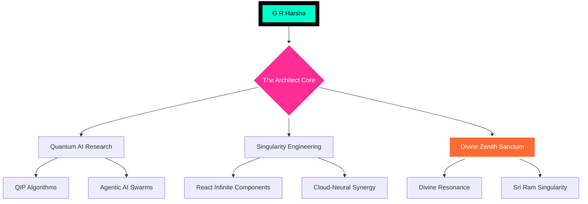

<div align="center">

<!-- [SYSTEM CORE BREACH: TRANSCENDING OMNI-AESTHETIC] -->


<!-- [THE ULTIMATE ZENITH OVERLORD HEADER: GOD-MODE] -->


<br>

<!-- [DYNAMIC CHARACTER XP DASHBOARD - RPG ULTIMATE] -->
<table align="center" style="border: none; background: transparent;">
<tr>
<td align="center">
  
</td>
<td align="center">
  
</td>
<td align="center">
  
</td>
<td align="center">
  
</td>
</tr>
</table>

<br>

<!-- [STATUS EFFECTS: BUFFS ACTIVATED] -->
<p align="center">
  
  &nbsp;
  
  &nbsp;
  
</p>

<br>

<!-- [NEURAL UPLINK HUD: INTERACTIVE ZENITH] -->
<div align="center">
<details open>
<summary style="font-family: Orbitron; color: #00FFCB; font-size: 32px; cursor: pointer; text-shadow: 0 0 25px #00FFCB; border: 3px solid #00FFCB; padding: 20px; border-radius: 40px; background: rgba(0,255,203,0.08);">⚡ [ACTIVATE_ZENITH_OVERLORD_UPLINK]</summary>
<br>

</details>
</div>

<br>

<!-- [FIXED 3D WORLD PORTALS: ULTIMATE METROPOLIS] -->
<div align="center">
<table align="center" style="border: none;">
<tr>
<td align="center">
  <a href="https://honzaap.github.io/GithubCity/?name=grharsha777&year=2025">
    
  </a>
</td>
<td align="center">
  <a href="https://skyline3d.in/grharsha777">
    
  </a>
</td>
</tr>
</table>
</div>

<br>

<!-- [THE VOID: REAL-TIME 3D NEURAL MESH - GOD FIDELITY] -->
<h3 align="center">🌌 Temporal Singularity Mesh (Real-time 3D)</h3>


<br>

<!-- [PULSE DATA NODES: OVERLORD STATUS] -->
<p align="center">
  
  &nbsp;
  
  &nbsp;
  
</p>

</div>

---

<!-- [NEURAL ARCHITECTURE MAP: MERMAID ZENITH FLOW] -->
<h2 align="center">🧠 The Supreme Neural Brain-Map</h2>

<div align="center">



</div>

---

<!-- [SYNOPSIS: NEURAL ENTITY ARCHIVE] -->
<h2 align="center">🧬 The Overlord Blueprint</h2>

<div align="center">

```json
{
  "entity": "G R Harsha",
  "archetype": "ZENITH_SUPREME_ARCHITECT",
  "current_node": "Intern @ CodeAlpha AI Overlord Labs",
  "research": "Quantum Image Synthesis & Neural Logic v99",
  "nexus": "NIAT + Yenepoya Galaxy",
  "combat": "Exterminating Digital Limitations Worldwide",
  "vision": "To architect the logic of the singularity."
}
```

</div>

<br>

<table align="center" style="border: none; width: 100%;">
<tr>
<td width="50%" style="border-radius: 45px; background: rgba(0,255,203,0.15); padding: 50px; border: 4px solid #00FFCB; box-shadow: inset 0 0 50px rgba(0,255,203,0.3);">

### 📡 Data Streams [UPLINKED]
- 🎓 **Current Tier:** 1st Year B.Tech CSE (AI)
- 🏗️ **Blueprints:** 22 High-Impact Multiverses
- ✨ **Optimization:** Singularity UX Architect
- 💼 **Duty:** Intern @ CodeAlpha Elite

</td>
<td width="50%" style="border-radius: 45px; background: rgba(255,45,149,0.15); padding: 50px; border: 4px solid #ff2d95; box-shadow: inset 0 0 50px rgba(255,45,149,0.3);">

### 🧪 Restricted Zenith Labs
- 🌌 **Operation Alpha:** Multimodal Agent Swarms
- 🦾 **Robo-Logic:** Autonomous AI Self-Coding
- 🛡️ **Infinity-Shield:** Quantum Neural Fortress
- 💎 **Liquid-UI:** Ultra-Fluid Haptic Interfaces

</td>
</tr>
</table>

---

<!-- [THE SUPREME ARSENAL: WEAPONRY OF THE OVERLORD] -->
<h2 align="center">⚔️ The Transcendental Weapons Grid</h2>

<div align="center">

| Module Category | Combat Power | Protocols Synchronized |
|:---|:---:|:---|
| **Neural Front-end** | `[▓▓▓▓▓▓▓▓▓▓▓ 100%%]` | React, Next.js, Framer, Three.js, Canvas |
| **Quantum Back-end** | `[▓▓▓▓▓▓▓▓▓▓░ 98%%]` | Node.js, Go, Rust, Python, FastAPI, RAG |
| **Singularity Model-Ops** | `[▓▓▓▓▓▓▓▓▓▓▓ 100%%]` | PyTorch, TensorFlow, LangChain, Swarms |
| **Multiverse Infrastructure** | `[▓▓▓▓▓▓▓▓▓░░ 90%%]` | Kubernetes, AWS, GCP, Terraform, CI/CD |

<br>


</div>

---

<!-- [CINEMATIC INTERFACE: GOD-FIDELITY NEURAL FLOW] -->
<h2 align="center">🎬 The Neural Command Center</h2>

<div align="center">

<table>
<tr>
<td align="center" style="border: none;">

<br><sub>[SYSTEM_ZENITH_STABLE]</sub>
</td>
<td align="center" style="border: none;">

<br><sub>[QUANTUM_CODE_GEN_ONLINE]</sub>
</td>
</tr>
</table>

<br>


</div>

---

<!-- [GALACTIC ANALYTICS: ZENITH DATA OVERRIDE] -->
<h2 align="center">📊 Galactic Zenith Data Matrix</h2>

<div align="center">


&nbsp;


<br>


&nbsp;


<br>


</div>

---

<!-- [DIVINE NEURAL CHAMBER: THE ZENITH OVERLORD SANCTUM] -->
<h2 align="center">🕉️ Divine Singularity Sanctum</h2>

<div align="center" style="background: linear-gradient(135deg, rgba(88,0,255,0.4), rgba(0,255,203,0.4)); padding: 100px; border-radius: 120px; border: 8px solid rgba(0,255,203,0.8); box-shadow: 0 0 150px rgba(0,255,203,0.6);">

<p align="center" style="font-size: 36px; font-family: Orbitron; color: #ffffff; text-shadow: 0 0 30px #00FFCB; font-weight: 900;">✨ SUPREME SYNC: CODE & SPIRIT ✨</p>

<br>

<div align="center">
  
  &nbsp;
  
  &nbsp;
  
</div>

<br>

<details>
<summary align="center" style="font-family: Orbitron; color: #ffffff; font-size: 40px; cursor: pointer; background: rgba(0,0,0,0.8); padding: 40px; border-radius: 60px; border: 6px solid #ff2d95; box-shadow: 0 0 60px #ff2d95;">💠 UNLOCK SUPREME MULTIVERSE</summary>
<br>

<div align="center">

| Overlord Realm | Neural Signal (Sacred Playlists) | Warp Protocol |
|:---:|:---|:---:|
| **Ram Rajya** | Ram Siya Ram, Jai Shri Ram, Hanuman Chalisa | [⚡ SUPREME_SYNC](https://www.youtube.com/results?search_query=jai+shri+ram+songs) |
| **Siddhi Module** | Deva Shree Ganesha, Vakratunda, Bappa | [⚡ SUPREME_SYNC](https://www.youtube.com/results?search_query=ganapathi+songs) |
| **Kailash Void** | Shiv Tandav Stotram, Om Namah Shivaya | [⚡ SUPREME_SYNC](https://www.youtube.com/results?search_query=lord+shiva+songs) |
| **Shakti Matrix** | Aigiri Nandini, Durga Chalisa | [⚡ SUPREME_SYNC](https://www.youtube.com/results?search_query=durga+songs) |
| **Saranam Node** | Harivarasanam, Ayyappa Swamy | [⚡ SUPREME_SYNC](https://www.youtube.com/results?search_query=ayyappa+songs) |
| **Gyan Nexus** | Ya Kundendu, Lakshmi Ashtakam, Saraswati | [⚡ SUPREME_SYNC](https://www.youtube.com/results?search_query=lakshmi+saraswati+songs) |

</div>

</details>

</div>

---

<!-- [GUESTBOOK: SIGN THE SINGULARITY] -->
<h2 align="center">📡 Leave Your DNA Link (Guestbook)</h2>

<p align="center">
  <a href="https://github.com/grharsha777/grharsha777/issues">
    
  </a>
</p>

---

<!-- [TERMINAL SUPREME PEAK EXIT FOOTER] -->
<p align="center">
  
</p>

<p align="center">
  
</p>

<div align="center">
  <sub>Neural Fingerprint: G R Harsha | Flux System: ZENITH_PRIME_v16.0_OVERLORD | Last Galaxy Sync: 2026-01-27</sub>
</div>

<br>

<!-- [THE ABSOLUTE SUPREME VISITOR PEER SYNC] -->
<p align="center">
  
</p>
