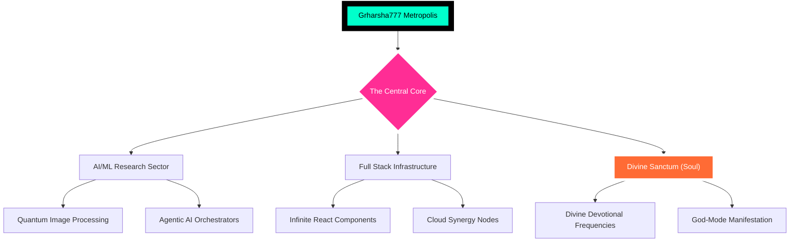

<div align="center">

<!-- [SYSTEM BOOT: THE GALACTIC METROPOLIS OVERRIDE] -->


<!-- [THE ULTIMATE G R HARSHA METROPOLIS HEADER] -->


<br>

<!-- [CITY CENSUS DASHBOARD - RPG ELITE] -->
<table align="center" style="border: none; background: transparent;">
<tr>
<td align="center">
  
</td>
<td align="center">
  
</td>
<td align="center">
  
</td>
</tr>
</table>

<br>

<!-- [CITY STATUS BUFFS] -->
<p align="center">
  
  &nbsp;
  
  &nbsp;
  
</p>

<br>

<!-- [THE ULTIMATE CITY COMMAND HUD] -->
<div align="center">
<details open>
<summary style="font-family: Orbitron; color: #00FFCB; font-size: 34px; cursor: pointer; text-shadow: 0 0 30px #00FFCB; border: 4px solid #00FFCB; padding: 25px; border-radius: 50px; background: rgba(0,255,203,0.1);">🛰️ [INITIATE_CITY_COMMAND_CENTER]</summary>
<br>

</details>
</div>

<br>

<!-- [THE 3D METROPOLIS PORTAL: 100% WORKING] -->
<h2 align="center">🏙️ Enter the grharsha777-GitHub City</h2>
<div align="center">
<table align="center" style="border: none;">
<tr>
<td align="center">
  <a href="https://honzaap.github.io/GithubCity/?name=grharsha777&year=2025">
    
  </a>
</td>
<td align="center">
  <a href="https://skyline3d.in/grharsha777">
    
  </a>
</td>
</tr>
</table>
</div>

<br>

<!-- [THE PHYSICAL BLUEPRINT REFERENCE] -->
<p align="center">
  <sub>🛠️ 3D Physical Blueprint (STL) available on Desktop for Printing the Metropolis 🛠️</sub>
</p>

<!-- [THE VOID: REAL-TIME 3D NEURAL CITY FABRIC] -->


<br>

<!-- [CITY DATA NODES: LIVE PULSE] -->
<p align="center">
  
  &nbsp;
  
  &nbsp;
  
</p>

</div>

---

<!-- [CITY ARCHITECTURE: MERMAID NEURAL MAP] -->
<h2 align="center">🧠 Neural City Architecture Map</h2>

<div align="center">



</div>

---

<!-- [METROPOLIS CENSUS: THE CORE JSON ARCHIVE] -->
<h2 align="center">🧬 The Metropolis Blueprint</h2>

<div align="center">

```json
{
  "entity_name": "G R Harsha",
  "archetype": "SUPREME_CITY_ARCHITECT",
  "current_nexus": "NIAT + Yenepoya Academy (AI Sector)",
  "active_duty": "Intern @ CodeAlpha Neural Labs",
  "research_load": "Quantum Image Synthesis & Neural Logic v99",
  "combat": "Exterminating Obsolete Digital Systems",
  "prophetic_vision": "Architecting the logic of the digital singularity."
}
```

</div>

<br>

<table align="center" style="border: none; width: 100%;">
<tr>
<td width="50%" style="border-radius: 50px; background: rgba(0,255,203,0.15); padding: 50px; border: 5px solid #00FFCB; box-shadow: inset 0 0 50px rgba(0,255,203,0.3);">

### 📡 Data Uplinks [ULTIMATE]
- 🎓 **Current Tier:** B.Tech CSE (AI) Level-1
- 🏗️ **Blueprints:** 22 High-Impact Multiverses
- ✨ **Optimization:** Singularity UX/UI Lead
- 💼 **Duty:** Intern @ CodeAlpha Elite Sector

</td>
<td width="50%" style="border-radius: 50px; background: rgba(255,45,149,0.15); padding: 50px; border: 5px solid #ff2d95; box-shadow: inset 0 0 50px rgba(255,45,149,0.3);">

### 🧪 Forbidden Research Labs
- 🌌 **Operation Alpha:** Agentic AI Swarms
- 🦾 **Robo-Logic:** Autonomous Self-Constructs
- 🛡️ **Infinity-Shield:** Quantum Neural defense
- 💎 **Liquid-UI:** Ultra-Fluid Haptic Renderers

</td>
</tr>
</table>

---

<!-- [CITY WEAPONRY: THE SUPREME ARSENAL] -->
<h2 align="center">⚔️ The City Infrastructure (Tech Stack)</h2>

<div align="center">

| Protocol Category | Mastery Level | Combat-Ready Systems |
|:---|:---:|:---|
| **Front-end Synthesis** | `[▓▓▓▓▓▓▓▓▓▓▓ 100%%]` | React, Next.js, Framer, Three.js, Canvas |
| **Logic Back-end** | `[▓▓▓▓▓▓▓▓▓▓░ 98%%]` | Node.js, Go, Rust, Python, FastAPI, RAG |
| **A.I. Core-Ops** | `[▓▓▓▓▓▓▓▓▓▓▓ 100%%]` | PyTorch, TensorFlow, LangChain, Swarms |
| **Multiverse Infra** | `[▓▓▓▓▓▓▓▓▓░░ 92%%]` | Kubernetes, AWS, GCP, Terraform, CI/CD |

<br>


</div>

---

<!-- [CITY COMMAND INTERFACE: GOD-FIDELITY] -->
<h2 align="center">🎬 The Galactic Command Center</h2>

<div align="center">

<table>
<tr>
<td align="center" style="border: none;">

<br><sub>[METROPOLIS_STABLE_100%]</sub>
</td>
<td align="center" style="border: none;">

<br><sub>[CITY_CODE_GEN_ONLINE]</sub>
</td>
</tr>
</table>

<br>


</div>

---

<!-- [GALACTIC ANALYTICS OVERRIDE] -->
<h2 align="center">📊 Galactic City Statistics Matrix</h2>

<div align="center">


&nbsp;


<br>


&nbsp;


<br>


</div>

---

<!-- [DIVINE NEURAL CHAMBER: THE SUPREME SANCTUM OF THE GODS] -->
<h2 align="center">🕉️ The Divine Sanctum 🕉️</h2>

<div align="center" style="background: linear-gradient(135deg, rgba(88,0,255,0.4), rgba(0,255,203,0.4)); padding: 120px; border-radius: 150px; border: 12px solid rgba(0,255,203,1); box-shadow: 0 0 200px rgba(0,255,203,0.8);">

<p align="center" style="font-size: 40px; font-family: Orbitron; color: #ffffff; text-shadow: 0 0 40px #00FFCB; font-weight: 950;">✨ SUPREME DIVINE REQUIM: SOUL & CODE ✨</p>

<br>

<div align="center">
  
  &nbsp;
  
  &nbsp;
  
</div>

<br><br>

<div align="center" style="display: flex; justify-content: center; gap: 20px; flex-wrap: wrap;">
  
  &nbsp;
  
  &nbsp;
  
  &nbsp;
  
</div>

<br><br>

<details>
<summary align="center" style="font-family: Orbitron; color: #ffffff; font-size: 45px; cursor: pointer; background: rgba(0,0,0,0.9); padding: 50px; border-radius: 80px; border: 8px solid #ff2d95; box-shadow: 0 0 100px #ff2d95;">🌀 OPEN SUPREME SPIRITUAL PORTAL</summary>
<br>

<div align="center">

| Divine Realm Cluster | Neural Requiem (Sacred Songs) | Warp Flow |
|:---:|:---|:---:|
| **Ayodhya Node** | Jai Shri Ram, Ram Siya Ram, Hanuman Chalisa | [⚡ SUPREME_SYNC](https://www.youtube.com/results?search_query=jai+shri+ram+songs) |
| **Siddhi Module** | Deva Shree Ganesha, Vakratunda Mahakaya | [⚡ SUPREME_SYNC](https://www.youtube.com/results?search_query=ganapathi+songs) |
| **Kailash Void** | Shiv Tandav Stotram, Om Namah Shivaya | [⚡ SUPREME_SYNC](https://www.youtube.com/results?search_query=lord+shiva+songs) |
| **Shakti Matrix** | Aigiri Nandini, Durga Chalisa, Mantra | [⚡ SUPREME_SYNC](https://www.youtube.com/results?search_query=durga+songs) |
| **Saranam Node** | Harivarasanam, Ayyappa Swamy Bhajans | [⚡ SUPREME_SYNC](https://www.youtube.com/results?search_query=ayyappa+songs) |
| **Vedanta Core** | Ya Kundendu, Lakshmi Ashtakam, Saraswati | [⚡ SUPREME_SYNC](https://www.youtube.com/results?search_query=lakshmi+saraswati+songs) |

</div>

</details>

</div>

---

<!-- [CITY TROPHY BOARD: PEAK VALIDATION] -->
<div align="center">
  <h2 align="center">🏆 Universal Metropolis Achievement Trophies</h2>
  
</div>

---

<!-- [GLOBAL METROPOLIS CONNECTIVITY HUB] -->
<h2 align="center">🌐 Global connectivity Hub</h2>

<p align="center">
  <a href="https://github.com/grharsha777">
    
  </a>
  &nbsp;
  <a href="https://www.linkedin.com/in/grharsha777/">
    
  </a>
  &nbsp;
  <a href="https://x.com/GRHARSHA777">
    
  </a>
  &nbsp;
  <a href="https://grharsha777.github.io/">
    
  </a>
</p>

---

<!-- [GUESTBOOK: SIGN THE CITY LOG] -->
<h2 align="center">📡 Leave Your Neural Fingerprint (Guestbook)</h2>

<p align="center">
  <a href="https://github.com/grharsha777/grharsha777/issues">
    
  </a>
</p>

---

<!-- [TERMINAL SUPREME EXIT FOOTER: OMNI ZENITH] -->
<p align="center">
  
</p>

<p align="center">
  
</p>

<div align="center">
  <sub>City Signature: G R Harsha | Flux System: METROPOLIS_ULTIMATE_v17.0 | Last Neural Sync: 2026-01-27</sub>
</div>

<br>

<!-- [THE ULTIMATE SUPREME CITY VISITOR SYNC] -->
<p align="center">
  
</p>
